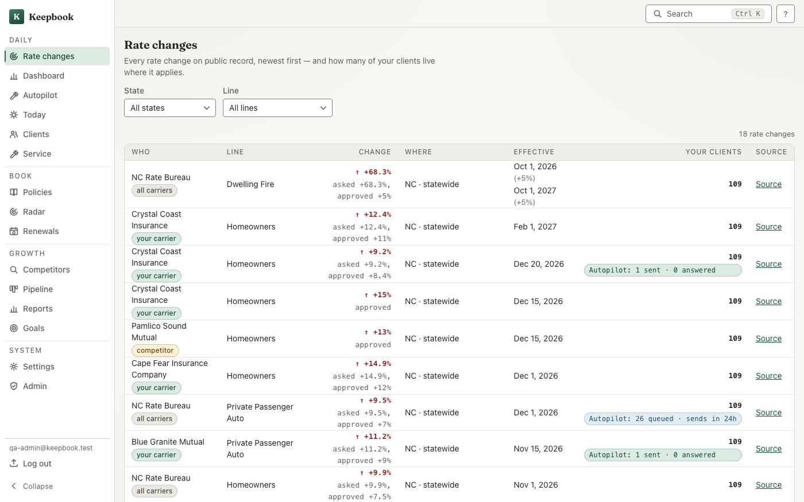
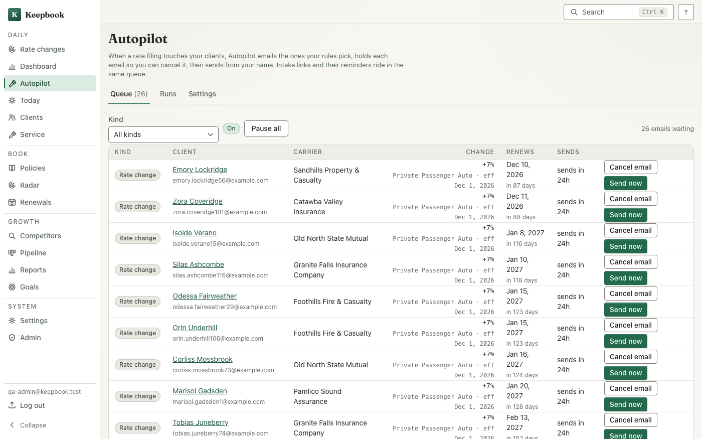
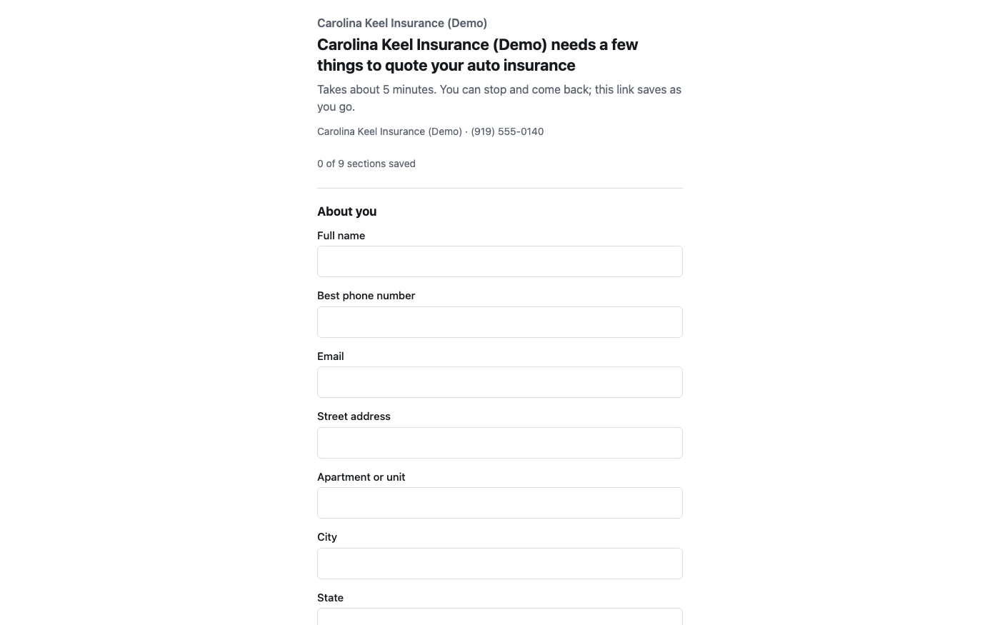

# Keepbook (public excerpt)

I'm Vihaan Kommireddy. I built Keepbook, software for independent insurance agencies. It reads every public carrier rate filing, finds which of an agency's clients are about to feel it, and drafts each of them an email in the agent's voice. The agent gets a day to cancel it, then it sends, follows up, and hands back a task when the client replies.

It is live at [thekeepbook.com](https://thekeepbook.com).

## What this repo is

The product repo is private because it is a real business. I copied the parts that are safe to show into this one so you can read actual code instead of taking my word for it. Nothing here builds on its own. It is an excerpt, not the app.

| Folder | What it is |
|---|---|
| `design-system/` | The whole hand-written design system: tokens for light and dark, 20+ React components, motion rules that switch off under reduced motion, and the tests. No UI library underneath. |
| `date-math/` | The date module every renewal and follow-up date goes through. Held to 100% branch coverage, because a wrong date in insurance is a missed renewal. |
| `backup/` | Nightly backups: a consistent SQLite snapshot, AES-256-GCM encryption with a scrypt-derived key, upload to S3-compatible storage, and a restore command that is tested end to end. |
| `landing/` | The public site: the landing page, the demo request form, and the privacy policy and terms pages, with a test that fails if the page text ever drifts from the legal documents. |
| `legal/` | The privacy policy and terms of service the site renders. |

What I left out on purpose: the rate-filing matching, Autopilot, the data pipeline, accounts, and everything about customers. That is the business.

## How I built it

I built Keepbook by directing AI coding agents. I write the specs, make every product and design call, review what comes back, and run the tests. Every task gets its own review before the next one starts, and nothing ships to the live site without my yes. The full product has about 1,500 unit tests and 130 end-to-end tests.

I keep an honest line between that and code I typed myself. For code where every line is mine, see [tool-calling-agent](https://github.com/VihaanKommireddy/tool-calling-agent) and the engine in [escrowscope](https://github.com/VihaanKommireddy/escrowscope).

## Stack

TypeScript, React 19, Vite, Node and Express, SQLite, Vitest, Playwright.

## Contact

vihaankommireddy@gmail.com
